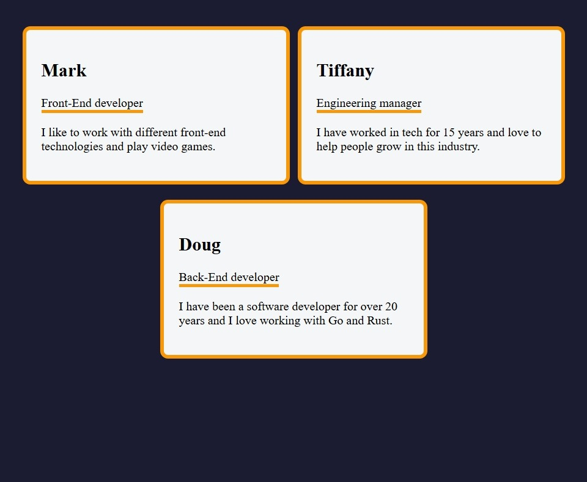

# 🧑‍💼 FCC Reusable Profile Card Component

A modular **React + TypeScript** profile card component built with **Vite**.  
This project demonstrates **component reusability**, **props-driven customization**, and modern frontend tooling.

---

## 🚀 Live Demo

[View Project](https://himanshu-kumar-2301.github.io/fcc-reusable-profile-card-component/)

---

## 🛠️ Tech Stack

- **React 18** - UI components
- **TypeScript** - type safety
- **Vite** - build tool & dev server
- **ESLint** - linting & code quality

---

## 📸 Screenshots



---

## 📚 Features

- Reusable profile card component for multiple projects.
- Customizable props for name, role, avatar, and links.
- Responsive design for desktop and mobile.
- Built with **React hooks** and **TypeScript** for type safety.
- Fast development experience using **Vite**.

---

## 📂 Project Structure

```code
root/
|--public/
|--src/
|  |--App.tsx
|  |--styles.css
|  |--main.tsx
|  |--components/
|  |  └──Card.tsx
|  └──assets/
|     └──screenshot.jpeg
|--index.html
|--package.json
|--vite.config.ts
|--tsconfig.json
|--README.md
```

---

## 🧑‍💻 How to Run Locally

1. Clone the repo:

    ```bash
    git clone https://github.com/himanshu-kumar-2301/fcc-reusable-profile-card-component.git
    ```

2. Navigate into the folder:

    ```bash
    cd fcc-reusable-profile-card-component
    ```

3. Install dependencies

    ```bash
    npm install
    ```

4. Start the dev server

    ```bash
    npm run dev
    ```

---

## 🎯 Learning Highlights

- Practiced component reusability with props.
- Configured TypeScript + Vite for modern wo
- Applied ESLint rules for consistent coding standards.
- Built a responsive, recruiter-friendly UI component.

---

## 📌 Future Improvements

- Add theme support (light/dark).
- Provide multiple layout variations (horizontal, vertical).
- Publish as an npm package for easy integration.

---
